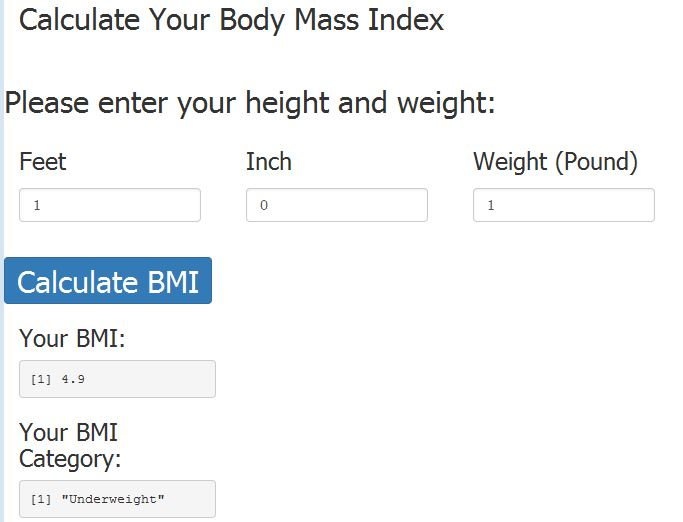
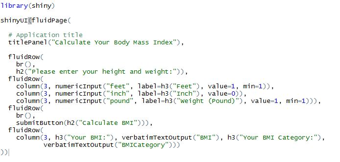

## BMI Calculation Web Application
1. This application is used to calculate the BMI and BMI category based on your height weight 
2. Enter the height (in "feet" and "inch") and weight (in "pound") and then click the "Calculate BMI" to calculate the BMI and BMI Category based on the input.
3. Here is the screen shot of the application

<div style='text-align: center;'>
    
</div> 

--- .class #1

## UI Code
1. Shiny app consists server code (server.R) and UI code (UI.R)
2. UI code consists of presentation/interface logic
3. Here is the UI code (UI.R)

<div style='text-align: center;'>
    
</div> 

---
## Server Code
1. Serer code (server.R) consists of the calculation logic
2. Two R functions (BMI and BMICatregory) are created to calculate the BMI and BMI category based on the input height and weight
3. Here is the Server Code:

<div style='text-align: center;'>
    
</div> 

---
## Calculate the BMI and BMI Category
1. Here is an example for BMI and BMI Category calculation

```r
BMI <- function (feet, inch, pound) { round(pound/(feet*12.0+inch)^2*703.0, digit=1)}
BMICategory <- function (feet, inch, pound) {
  b <- pound/(feet*12+inch)^2*703
  if (b < 18.5 ) {c <- 'Underweight'} else if (b <= 24.9) {c <- 'Normal'} 
  else if (b <= 29.9) {c<- 'Overweight'} else {c <- 'Obese'}; return(c)}
BMI(6, 2, 180 )
```

```
## [1] 23.1
```

```r
BMICategory(6, 2, 180)
```

```
## [1] "Normal"
```


